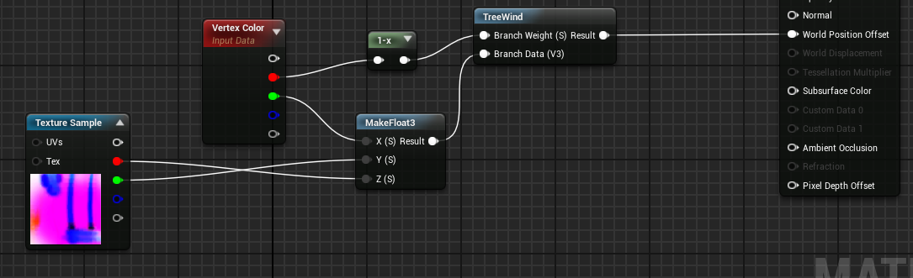
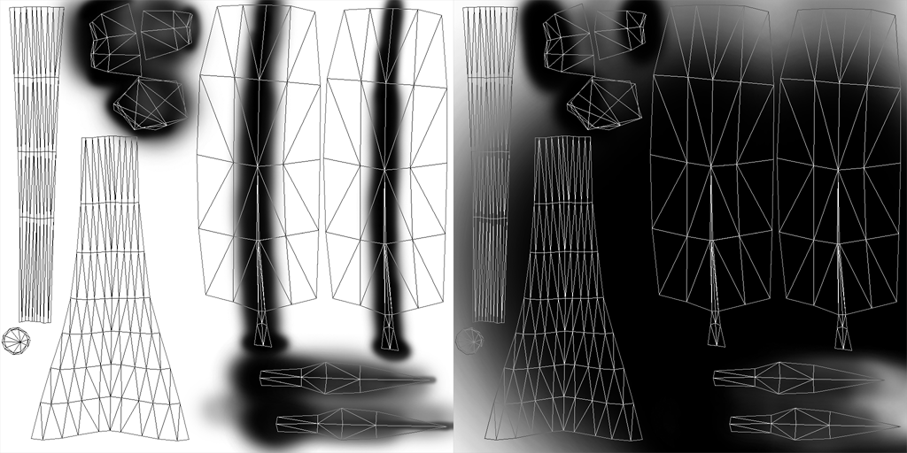
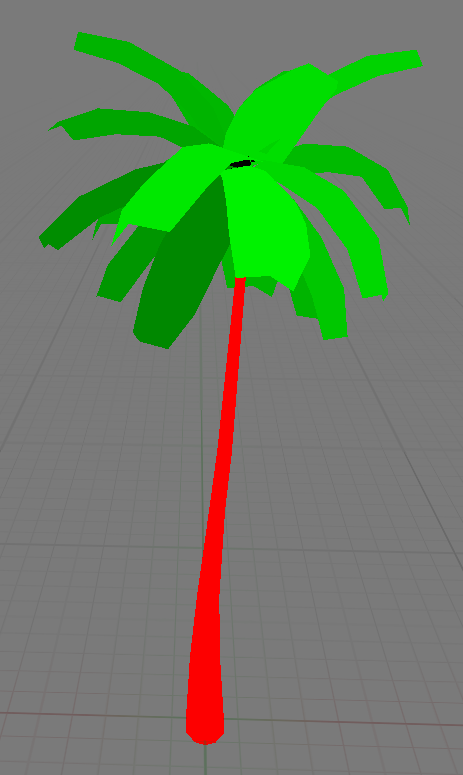
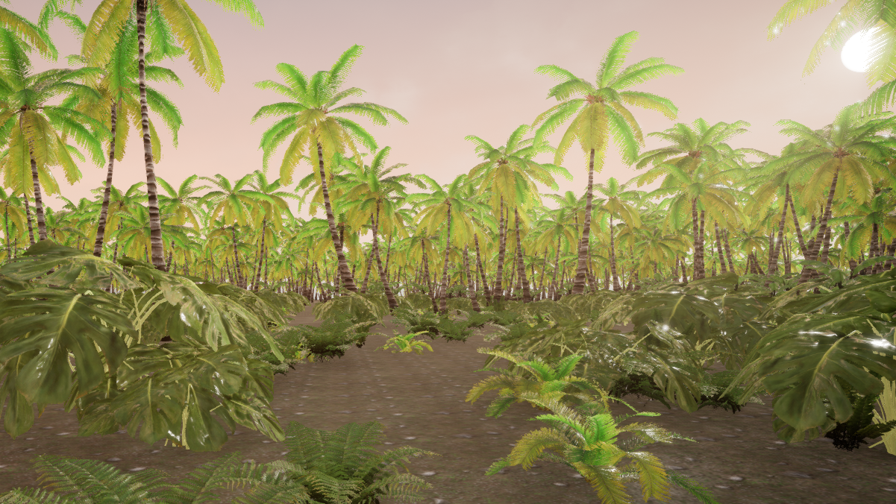
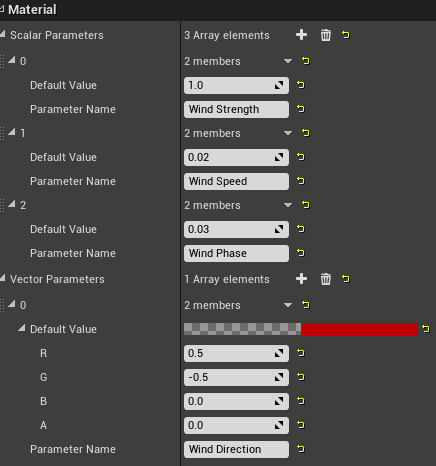
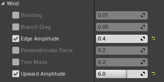

# Procedural Wind  
A procedural wind material for vegetation in UE4.

## Features
The material is designed for various vegetation types like trees (trunk and foliage), branches and bushes.

Features:
- configurable trunk animation such as bending or axis drag
- configurable foliage animation for branches and leaves via edge and branch attenuation
- material collection for controling the global wind settings
- level of detail	

## Usage

There are two material functions that compute the wind displacement:
- TreeWind, designed for trees, composed of a trunk and foliage animation
- TreeTrunkWind, contains no foliage animation and can be used for LOD materials
- FoliageWind, designed for bushes, composed of a main bending and foliage animation
- FoliageWindLow, contains no foliage animation and can be used for LOD materials

The material functions are easy to use and only require the per-branch data:

Thus, the vegetation assets will require the branch data such as:
- edge attenuation, for sideways movement of the leaf edges
- branch attenuation, for vertical movement of the leaf
- branch phase, phase variation of the leaf
- branch weight, weight of the foliage animation (eg. zero for trunk vertices)

The foliage data can be stored in the textures (left is the edge attenuation, right is the branch attenuation):

Or in the vertex colors (red channel is the branch weight, green channel is the branch phase):

NOTE. In the above case the branch weight is inverted, i.e. 1.0 weight for trunk.

The global wind settings can be controled in the WindSettings material collection.

## Preview

Global wind settings:

Material settings:

## Contributing

Based on:
- [Vegetation Procedural Animation and Shading in Crysis by Tiago Sousa](https://developer.nvidia.com/gpugems/GPUGems3/gpugems3_ch16.html)
- [GPU-Generated Procedural Wind Animations for Trees by Renaldas Zioma](https://developer.nvidia.com/gpugems/GPUGems3/gpugems3_ch06.html)

Bug reports and pull requests are welcome on GitHub at https://github.com/tuxalin/vegetation-shader.

## License

The code is available as open source under the terms of the [MIT License](http://opensource.org/licenses/MIT).
